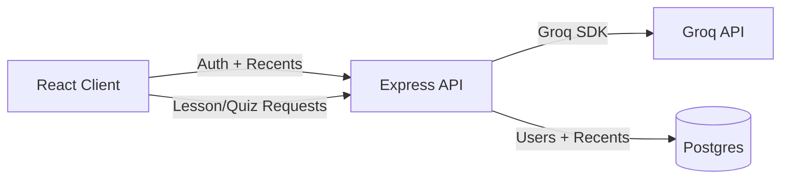

---

# 📘 EZTutor (MVP)

## 🚀 Overview
This project is a **web application MVP** designed to help teachers save time and boost productivity.  
The app provides three core features:
1. **Smart Lesson Planner** – AI-generated lesson outlines.  
2. **Quiz & Worksheet Generator** – AI-generated multiple-choice, short-answer, and essay questions.  
3. **Resource Organizer (Basic)** – Upload and auto-tag teaching resources for quick search.  

The goal is to keep the app **lean, fast, and immediately useful**, while laying the foundation for future expansion (grading, analytics, collaboration).

---

## 🧑‍🏫 Features
- **Lesson Planner**  
  - Input: Subject + Topic  
  - Output: Objectives, Key Points, Suggested Activities  
  - Export as PDF/Word or share digitally  

- **Quiz Generator**  
  - Input: Topic + Difficulty level  
  - Input: Topic + Difficulty + Grade level + Question mix  
  - Output: MCQs, Short Answer, Essay Questions  
  - Export as PDF/Word or share online  

- **Resource Organizer**  
  - Upload notes/slides  
  - Auto-tag by subject/topic  
  - Search bar for instant retrieval  

---

## 🛠️ Tech Stack
| Layer         | Tools/Frameworks                     |
|---------------|--------------------------------------|
| Frontend      | React, TailwindCSS, Axios            |
| Backend       | Node.js, Express                     |
| AI Services   | Groq API (free tier)                 |
| Database      | Postgres (Render, users + recents)   |
| File Storage  | Cloudinary / Firebase Storage        |
| Auth          | Local JWT (email + password)         |

---

## 📂 Project Structure
```
EZTutor/
│
├── docs/
│   ├── architecture.md
│   ├── DEPLOYMENT.md
│   └── SECURITY.md
│   └── api-schema.md
│
├── client/              # Frontend (React)
│   ├── public/
│   ├── .env.production
│   ├── postcss.config.js
│   └── src/
│       ├── components/
│       │   └── AppLayout.js
│       ├── pages/
│       │   ├── Dashboard.js
│       │   ├── LessonPlan.js
│       │   ├── QuizGenerator.js
│       │   └── ResourceHub.js
│       ├── App.js
│       └── index.css
│   └── tailwind.config.js
│
├── server/              # Backend (Express)
│   ├── routes/
│   ├── controllers/
│   ├── services/
│   ├── middleware/
│   ├── tests/
│   └── index.js
│
├── .env                 # Environment variables
├── package.json
├── CHANGELOG.md
├── RELEASE_CHECKLIST.md
└── README.md
```

---

## 🧭 Architecture Snapshot


---

## ⚙️ Installation & Setup

### 1. Clone the Repository
```bash
git clone https://github.com/refatwashere/EZTutor.git
cd EZTutor
```

### 2. Backend Setup
```bash
cd server
npm install
```
Create a `.env` file (or copy `.env.example`):
```
GROQ_API_KEY=your_groq_api_key_here
GROQ_MODEL=llama-3.1-8b-instant
GROQ_TIMEOUT_MS=20000
GROQ_MAX_RETRIES=2
EZTUTOR_API_KEY=optional_api_key_for_clients
JWT_SECRET=change_me
DATABASE_URL=
DB_SSL=true
DB_HOST=
DB_USER=
DB_PASSWORD=
DB_NAME=
DB_PORT=5432
PORT=5000
EZTUTOR_MODE=
```
Run the backend (from repo root you can also run `npm run start-server`):
```bash
node index.js
```

### 3. Frontend Setup
```bash
cd client
npm install
npm start
```

---

## 🔗 API Endpoints
- `POST /api/generate-lesson` → Generates lesson plan  
- `POST /api/generate-quiz` → Generates quiz  
- `POST /api/upload-resource` → Uploads resource (future)  
- `POST /api/auth/signup` → Create account  
- `POST /api/auth/login` → Login  
- `GET /api/auth/me` → Get current user  
- `GET /api/recents` → List recents  
- `POST /api/recents` → Add recent  
- `DELETE /api/recents` → Clear recents  

---

## 🧰 Validation & Safety
- Basic input validation is enforced on lesson and quiz endpoints.  
- Requests to `/api` are rate-limited (100 requests per 15 minutes per IP).  
- If `EZTUTOR_API_KEY` is set, clients must send `x-api-key` in requests.  

---

## 📦 Response Shape (Overview)
- Lesson plan response contains structured fields like `objectives`, `keyPoints`, and `activities`.  
- Quiz response contains `mcq`, `shortAnswer`, and `essay` arrays with answers, plus `gradeLevel`, `numQuestions`, and `questionWeights`.  

---

## 🖥️ User Flow
1. **Dashboard** → Choose action (Lesson Plan, Quiz, Resource Upload)  
2. **Lesson Plan Generator** → Input subject/topic → AI output → Export  
3. **Quiz Generator** → Input topic/difficulty → AI output → Export  
4. **Resource Hub** → Upload + search resources  

---

## 🧭 Client ↔ Server Notes
- The React app uses a CRA proxy to `http://localhost:5000`.  
- Client calls should use the `/api/...` prefix to reach the backend.  
- For production, set `REACT_APP_API_BASE` to your backend URL (e.g., `https://eztutor.onrender.com`).  

---

## ✅ Testing
- Backend tests:  
  - From `server/`, run `npm test`  

---

## 📚 Documentation
- `docs/architecture.md` → system overview and data flow  
- `docs/api-schema.md` → response schema overview  
- `docs/DEPLOYMENT.md` → production deployment guide  
- `docs/SECURITY.md` → security and API key notes  

---

## 🩺 Health Check
- `GET /health` returns uptime and a timestamp for monitoring.  
- `GET /health/groq` checks for Groq API key availability.  

---

## 🧯 Troubleshooting
- **400 model decommissioned**: update `GROQ_MODEL` to a supported Groq model (see Groq deprecations).  
- **401/403 invalid API key**: verify `GROQ_API_KEY` on the server and redeploy.  
- **429 quota exceeded**: switch to template mode (`EZTUTOR_MODE=template`) or reduce requests.  
- **Postgres connection errors**: confirm `DATABASE_URL` (preferred) or `DB_HOST`, `DB_USER`, `DB_PASSWORD`, `DB_NAME`, and inbound access.  
- **Frontend can’t reach API**: set `REACT_APP_API_BASE` to your deployed backend URL.  

---

## 📛 Status Badge
Use this snippet in your README or docs to show health status (replace the URL with your deployed host):
```md

```

---

## 🎨 Styling
- TailwindCSS is configured in `client/` with PostCSS.  
- Global styles live in `client/src/index.css`.  
- A lightweight theme system is provided using CSS variables and custom classes.  
- Fonts are set to Playfair Display for headings and Space Grotesk for body text.  
- Tailwind tokens are mapped in `client/tailwind.config.js` for brand colors.  
- Animations include staggered card reveals and shimmer skeletons.  
- UI now includes a sticky nav, hero section, and polished form panels.  
- A shared layout component provides consistent navigation across pages.  
- Dashboard includes “Recent outputs” and quick-start suggestions.  

---

## 🔐 Authentication
- Sign up and login with email + password (JWT).  
- Tokens are stored in `localStorage` and sent via `Authorization: Bearer <token>`.  
- Recents are scoped per user in Postgres, and the dashboard can clear them with one click.  

---

## ⚡ Performance Notes
- Server responses are compressed via `compression`.  
- Production builds disable sourcemaps via `client/.env.production`.  
- Server logs include latency and response size buckets.  

---

## 📈 Roadmap
- ✅ MVP: Lesson Planner + Quiz Generator + Resource Organizer  
- 🔜 Next: File storage integration, grading, analytics, collaboration tools  
- 🔮 Future: Teacher-student portal, AI-driven feedback, adaptive learning  

---

## 🤝 Contributing
1. Fork the repo  
2. Create a feature branch (`git checkout -b feature-name`)  
3. Commit changes (`git commit -m 'Add feature'`)  
4. Push branch (`git push origin feature-name`)  
5. Open a Pull Request  

---

## 📜 License
MIT License – free to use, modify, and distribute.

---
