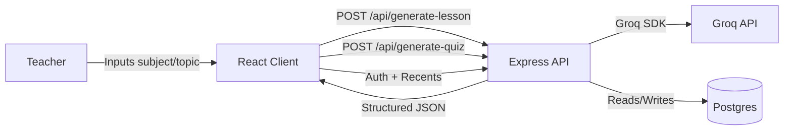

# EZTutor Architecture

## High-Level Overview
EZTutor is a lightweight full-stack MVP with a React client and an Express API.
The client handles user input and renders structured results, while the server
provides AI-generated lesson plans and quizzes.

## System Diagram (Mermaid)

## Runtime Components
- **Client**: React + TailwindCSS + Axios
  - Pages: Dashboard, LessonPlan, QuizGenerator, ResourceHub
  - Layout: shared navigation and theme system
- **Server**: Express + Groq SDK
  - Routes: `/api/generate-lesson`, `/api/generate-quiz`, `/api/auth/*`, `/api/recents`
  - Middleware: rate limiting, API key auth, JWT auth, error handler, compression
- **Database**: Postgres (users + recents)

## Data Flow (Lesson Plan)
1. User enters subject + topic.
2. Client posts to `/api/generate-lesson`.
3. Server validates input and calls Groq with a structured JSON prompt.
4. Server returns structured JSON.
5. Client renders sections and offers copy/download.

## Data Flow (Quiz)
1. User enters topic + difficulty.
2. Client posts to `/api/generate-quiz`.
3. Server validates input and calls Groq with a structured JSON prompt.
4. Server returns structured JSON.
5. Client renders MCQ, short answer, and essay sections.

## Data Flow (Auth + Recents)
1. User signs up or logs in and receives a JWT.
2. Client stores token and fetches `/api/recents`.
3. Server validates JWT and reads/writes user recents in Postgres.
4. Client renders recents and supports “Clear Recents.”
