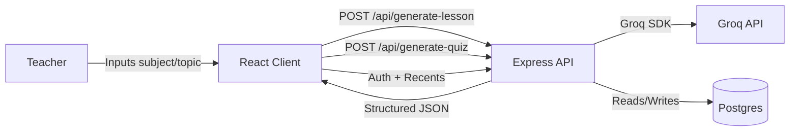

# EZTutor Architecture

## High-Level Overview
EZTutor is a lightweight full-stack MVP with a React client and an Express API.
The client handles user input and renders structured results, while the server
provides AI-generated lesson plans and quizzes.

## System Diagram (Mermaid)


## Runtime Components
- **Client**: React + TailwindCSS + Axios
  - Pages: Dashboard, LessonPlan, QuizGenerator, ResourceHub
  - Layout: shared navigation and theme system
- **Server**: Express + Groq SDK
  - Routes: `/api/generate-lesson`, `/api/generate-quiz`, `/api/auth/*`, `/api/recents`, `/api/support`
  - Middleware: rate limiting, API key auth, JWT auth, error handler, compression
- **Database**: Postgres (users + recents)

## Data Flow (Lesson Plan)
1. User enters subject + topic.
2. Client posts to `/api/generate-lesson`.
3. Server validates input and calls Groq with a structured JSON prompt.
4. Server returns structured JSON.
5. Client renders sections and offers copy/download.

## Data Flow (Quiz)
1. User enters topic + difficulty.
2. Client posts to `/api/generate-quiz`.
3. Server validates input and calls Groq with a structured JSON prompt.
4. Server returns structured JSON.
5. Client renders MCQ, short answer, and essay sections.

## Data Flow (Auth + Recents)
1. User signs up or logs in and receives a JWT.
2. Client stores token and fetches `/api/recents`.
3. Server validates JWT and reads/writes user recents in Postgres.
4. Client renders recents and supports “Clear Recents.”


## v2.0.0 Enhancements: Custom Content Management

### New Features
- **Custom Lesson Plans**: Teachers can create, edit, and manage custom lesson plans from scratch
- **Custom Quizzes**: Teachers can build custom quizzes with multiple question types (MCQ, short-answer, essay)
- **Content Management**: View, search, edit, and delete saved custom content
- **Dashboard Integration**: Quick-access buttons for custom content creation and management

### Database Schema Changes

**`lesson_plans` Table (NEW)**:
```sql
CREATE TABLE lesson_plans (
  id SERIAL PRIMARY KEY,
  user_id INTEGER NOT NULL REFERENCES users(id) ON DELETE CASCADE,
  title VARCHAR(200) NOT NULL,
  description TEXT,
  content JSONB NOT NULL,
  is_custom BOOLEAN DEFAULT true,
  created_at TIMESTAMPTZ DEFAULT CURRENT_TIMESTAMP,
  updated_at TIMESTAMPTZ DEFAULT CURRENT_TIMESTAMP
);
```

**`quizzes` Table (NEW)**:
```sql
CREATE TABLE quizzes (
  id SERIAL PRIMARY KEY,
  user_id INTEGER NOT NULL REFERENCES users(id) ON DELETE CASCADE,
  title VARCHAR(200) NOT NULL,
  difficulty VARCHAR(20),
  content JSONB NOT NULL,
  is_custom BOOLEAN DEFAULT true,
  created_at TIMESTAMPTZ DEFAULT CURRENT_TIMESTAMP,
  updated_at TIMESTAMPTZ DEFAULT CURRENT_TIMESTAMP
);
```

### New Frontend Pages
- `/custom-lesson` → `CustomLessonPlan.js` — Create custom lesson plans with form
- `/custom-quiz` → `CustomQuiz.js` — Build custom quizzes with multi-question types
- `/my-lessons` → `MyLessonPlans.js` — List, search, and manage saved lessons
- `/my-quizzes` → `MyQuizzes.js` — List, search, and manage saved quizzes
- `/lesson-plans/:id` → `EditLessonPlan.js` — Edit existing lesson plan
- `/quizzes/:id` → `EditQuiz.js` — Edit existing quiz

### New API Endpoints
| Method | Path | Purpose |
|--------|------|---------|
| POST | `/api/lesson-plans` | Create custom lesson plan (auth required) |
| GET | `/api/lesson-plans` | List user's lesson plans (auth required) |
| GET | `/api/lesson-plans/:id` | Get specific lesson plan (auth required) |
| PUT | `/api/lesson-plans/:id` | Update lesson plan (auth required) |
| DELETE | `/api/lesson-plans/:id` | Delete lesson plan (auth required) |
| POST | `/api/quizzes` | Create custom quiz (auth required) |
| GET | `/api/quizzes` | List user's quizzes (auth required) |
| GET | `/api/quizzes/:id` | Get specific quiz (auth required) |
| PUT | `/api/quizzes/:id` | Update quiz (auth required) |
| DELETE | `/api/quizzes/:id` | Delete quiz (auth required) |

### New Controllers
- `server/controllers/customLessonController.js` — CRUD operations for lesson plans
- `server/controllers/customQuizController.js` — CRUD operations for quizzes

### Data Flow (Create Custom Lesson Plan)
1. User navigates to `/custom-lesson`
2. Fills form with subject, topic, objectives, key points, activities, assessment ideas, materials, differentiation
3. Client validates inputs (title max 200 chars, arrays max items, etc.)
4. Client POSTs `/api/lesson-plans` with JWT in Authorization header
5. Server validates JWT and request body
6. Server inserts into `lesson_plans` table with `is_custom = true`
7. Client redirects to `/my-lessons` to show updated list

### Data Flow (Edit Lesson Plan)
1. User navigates to `/lesson-plans/:id`
2. Frontend GETs `/api/lesson-plans/:id` to load current content
3. Form pre-fills with existing data
4. User modifies fields (subject, objectives, activities, etc.)
5. Client PUTs `/api/lesson-plans/:id` with updated content
6. Server validates ownership (user_id check) and updates `updated_at`
7. Client shows success message and updates list

### Dashboard Enhancement
New "Your Content" section with quick-access buttons:
- Create Lesson from Scratch → `/custom-lesson`
- My Lesson Plans → `/my-lessons`
- Create Quiz from Scratch → `/custom-quiz`
- My Quizzes → `/my-quizzes`

---

## Planned: Google Drive Integration (v2.1)

### Phase 1 Goals
- Teachers can export lesson plans and quizzes to Google Drive
- Auto-organize exports in `/EZTutor/Subject/Topic/` folder structure
- One-way export (EZTutor → Google Docs format)
- Simple OAuth 2.0 authentication workflow

### Proposed Architecture

**New Service**:
- `server/services/googleDriveService.js` — Handles OAuth, token management, export logic

**New Database Columns** (on `users` table):
```sql
google_access_token TEXT,           -- Encrypted
google_refresh_token TEXT,          -- Encrypted
google_token_expires_at TIMESTAMPTZ
```

**New Endpoint**:
```
POST /api/export-to-drive
  Auth: JWT + Google OAuth
  Body: { contentType: "lesson"|"quiz", contentId: number }
  Response: {
    success: true,
    googleDriveUrl: "https://drive.google.com/open?id=...",
    fileName: "Chapter 1",
    folderPath: "EZTutor/Math/Fractions"
  }
```

### Google Drive Folder Structure
```
EZTutor/
├── Lesson Plans/
│   ├── Math/
│   │   ├── Fractions/
│   │   │   └── Introduction to Fractions.docx
│   │   └── Algebra/
│   └── Science/
└── Quizzes/
    ├── Math/
    └── Science/
```

### OAuth 2.0 Configuration
- **Scope**: `drive.file` only (least privilege)
- **Flow**: First-time user redirects to Google consent screen
- **Token Refresh**: Automatic refresh when expired (access token: 1 hour)
- **Security**: Tokens encrypted with AES-256 before DB storage

### Implementation Timeline
- Week 1: Backend (OAuth, service, endpoint)
- Week 2: Frontend (Google Sign-In, export buttons)
- Week 3: Testing and beta release

### Success Criteria
✅ Export completes in <5 seconds  
✅ Documents in correct `/EZTutor/Subject/Topic/` structure  
✅ Token refresh transparent (no user friction)  
✅ Zero security incidents  
✅ 99.9% uptime for export endpoint  

---

## Future Roadmap

**Phase 2 (v2.2)**: Organized Backups
- Automatic weekly backups of all content
- Restore from backup on account recovery
- Version history in Google Drive

**Phase 3 (v2.3)**: Collaborative Editing
- Share lessons with other teachers
- Permission roles (viewer, editor, owner)
- Comments and suggestions workflow
- Limited bi-directional sync

**Phase 4+ (v3.0)**: Advanced Features
- Dropbox & OneDrive export
- Full Resource Hub implementation
- Quiz performance analytics
- Class roster management
- LMS integration (Google Classroom, Canvas)
